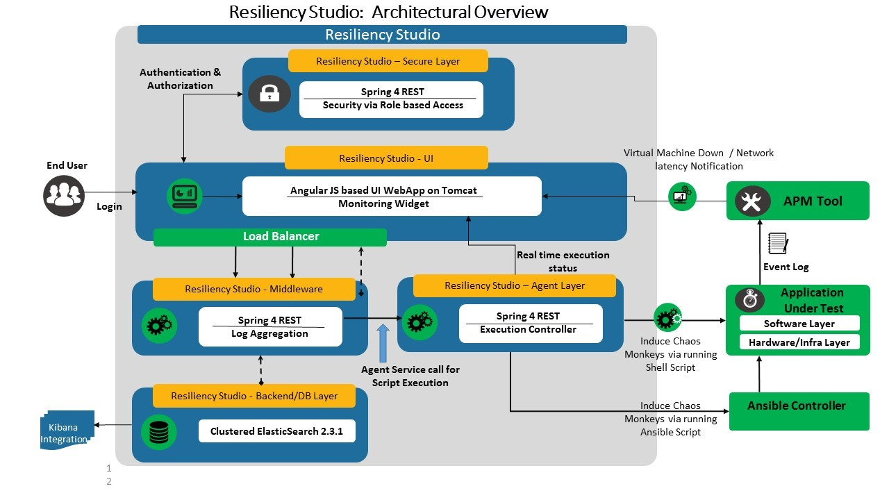
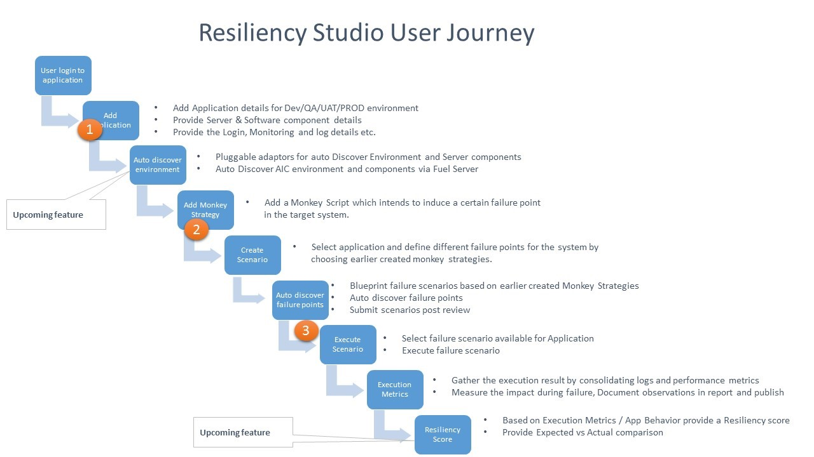
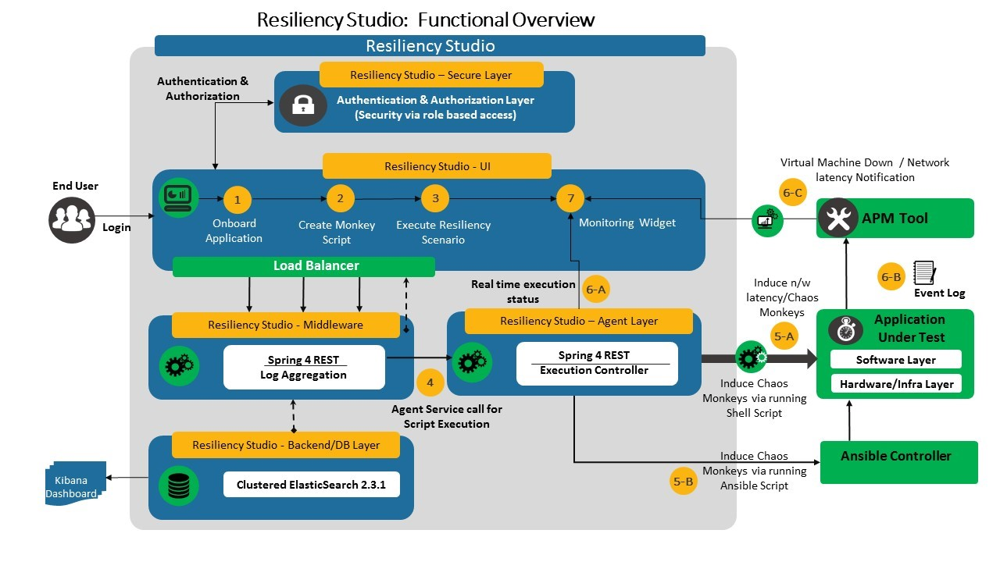
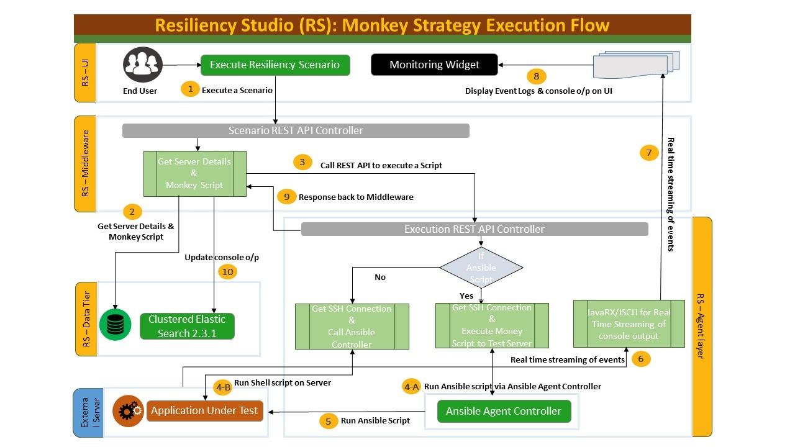
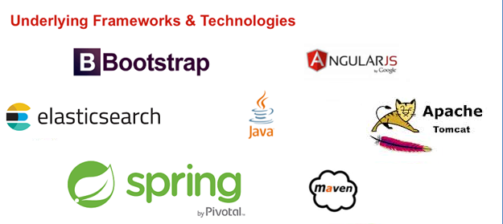

## Resiliency Studio ##

### Overview ###

In today's digital age, as the systems and services are becoming extremely distributed and hosted on cloud, "failures" are bound to happen and this is going to be the new normal. Systems are expected to be resilient to ensure no/minimal degradation of user experience in the event of failures. Popular solutions like Netflix's SimianArmy created healthy awareness and need for resiliency in SDLC. However, they are mostly service based, focus on Chaos injection and lacks holistic resilience validation dimension. This created an opportunity to build a self-service Studio style platform for failure strategy development and collaboration, with simple, yet, effective user interface easy enough for everyone to use. Our invention "AT&T Resiliency Studio" is a self-service Resilience Validation Platform, which helps to identify failure points within a system, aids to engineer applications to be fault-tolerant with self-healing capabilities.

Resilience testing is a crucial step in ensuring applications perform well in real-life conditions. It is part of the non-functional sector of software testing that also includes compliance testing, endurance testing, load testing, recovery testing and others.

As the term indicates, resilience in software describes its ability to withstand stress and other challenging factors to continue performing its core functions and avoid loss of data.

Since we can never ensure a 100% rate of avoiding failure for software, you should provide functions for recovery from disruptions in your software. By implementing fail-safe capacities, it is possible to largely avoid data loss in case of crashes and to restore the application to the last working state before the crash with minimal impact on the user.

Resiliency Studio is a tool/software developed to enable end to end resilience certification across applications. It helps validate and embed resiliency into all software platforms, infrastructure and operations, thereby enabling less disruption for customer experience.

In today's organization customers are becoming the key members to decide whether application stays/goes away. The implication in customer experience decides on the life span of the product in the market. 

This software enables every engineering team to look at this as primary goal. 
 
**Features of Resiliency Studio?**

* Extensible Architecture to any application/ domain

* Provides holistic resiliency view by leveraging principles of FMEA (Failure mode and effect analysis)

* Automated Failure Point Discovery

* Automated Execution of Failure Scenarios / Chaos Monkey

* Single pane view of 3-Dimensional data, namely, execution, monitoring and logging events

* Self-service federated platform with reusable chaos strategies

The above features are delivered to the user by means of a simple, user-friendly dashboard which helps users to navigate between onboarding applications and ultimately viewing execution metrics. 

### Architecture ###

### User Journey ###

### Functional flow ###

### Monkey Strategy execution flow ###

### Contributors ###

Resiliency Studio's Open Source Projects (the "Project") 
Any Contributor to the Project must accept and sign an Agreement indicating agreement to the license terms below. Except for the license granted in this Agreement to AT&T and to recipients of software distributed by AT&T, You reserve all right, title, and interest in and to Your Contributions; this Agreement does not impact Your rights to use Your own Contributions for any other purpose.

<Agreement Link here>

This project adheres to the <Link Here>. By participating, you are expected to honor this code.

### Frameworks & Technologies ###

### Software Requirements with version ###

Java (JDK)	1.8

Tomcat	7.0.47

Elastic Search	2.3.1

Maven	3.3.9

[Setup Instructions](Installation.md)

[User Guide](userguide.md)